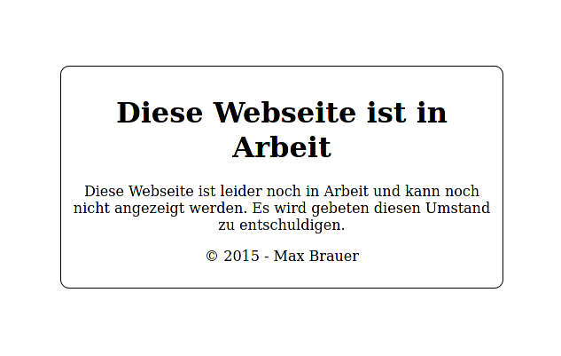

+++
title = "Neue Webpräsenz"
[taxonomies]
tags=["mabron","github"]
+++

Seit dem 17. Juni 2015 habe ich diese Domain nun und einige Projekte wurden damit umgesetzt und
experimentiert.
Viele Subdomains wurden seitdem angelegt und eingerichtet. Nur die Hauptseite ist
dabei jahrelang unverändert geblieben.

<!-- more -->

Immer wieder habe ich mir die Frage gestellt, was ich damit überhaupt anstellen will. Hauptsächlich
ging es mir darum überhaupt eine Domain unter meiner Kontrolle zu haben um damit irgendwas zu
machen.

Zwischenzeitlich habe ich mir noch 3 weitere Domains zugelegt, welche aber schon ihren Zweck
zugeführt wurden und auch im Betrieb sind.

Jetzt nach fast 6 Jahren und vielen Nachfragen seitens meiner Freunde habe ich mich nun endlich
entschieden mich dieser Schande endlich zu widmen.

Ich habe mich dafür entschieden auf der Hauptseite hauptsächlich meine Projekte, einen Blog
und ein Teil meines Lebens vorzustellen. Viele Sachen, welche in irgendwelchen Ordnern oder
Subdomains versteckt wurden, sollen jetzt ins Tageslicht gerückt werden.

In all den Jahren habe ich mit verschiedenen Techniken experimentiert und nun habe ich eine
ungefähre Vorstellung davon wie meine Webseite eigentlich funktionieren soll.

## Warum nicht einfach irgendein CMS?

> CMS steht für **`C`ontent `M`anagement `S`ystem** und verwaltet die Inhalte in irgendeiner Art.

Die einfachste Art wäre alles selbst in HTML zu schreiben. Am Anfang habe ich das tatsächlich
versucht, aber irgendwann habe ich es einfach aufgegeben, da es äußerst umständlich ist alles per
Hand zu coden. Ein weiterer Nachteil war die umständliche Bereitstellung. Ich musste alles auf 
meinem Computer erstellen und dann über FTP (später SFTP) auf den Server übertragen.

Das hat häufig zu irgendwelchen Fehlern geführt, da ich irgendwelche Dateien vergessen habe, 
fehlerhaft waren oder noch für mein lokales System ausgelegt waren. Das alles zu automatisieren
wäre ein Traum.

Auf der anderen Seite stehen CMS Systeme wie Wordpress oder TYPO3. Diese soll ich einmal auf dem 
Server installieren und dann sollten sie sich um alles kümmern. 
Leider ist dem nicht ganz so und sie haben gleich mehrere Nachteile:

- Sie sind unheimlich groß. Ich muss viel installieren, um eine einfache Webseite hinzubekommen.
- Sie sind langsam. Jedes dieser CMS Systeme führt bei jeden Seitenaufruf PHP Code aus (auf dem
    Webserver geht leider nur PHP) und machen einige Datenbankabfragen. 
    
    An sich nichts schlechtes für eine flexible Anwendung, aber leider nichts für mich. Ich habe 
    hauptsächlich statischen Content und dafür muss ich nicht 1000 mal die Seite neu aufbauen.
- Die CMS Systeme für meine Zwecke zu optimieren und anzupassen braucht viel Arbeit. Das wird dann
    nur noch "hacky" und unschön.
- Die CMS Systeme müssen ständig gepflegt werden. CMS Systeme liefern leider ein paar zusätzliche
    Schwachstellen mit. Man kann hier nur hoffen, dass sie rechtzeitig entdeckt und gefixt werden.
    Und dann muss ich noch schnell die Updates installieren, wenn die raus sind (und das ist
    sehr häufig der Fall).

Wie man sieht haben beide Seiten sehr viel Potenzial für zusätzliche Arbeit (was ich ja eigentlich
vermeiden möchte).

## Wofür habe ich mich entschieden?

Ich habe in den letzten Jahren viel mit Markdown experimentiert und bin ehrlich gesagt davon sehr
angetan. Das sind kleine Textdateien wo man Stile ganz leicht einfügen kann und trotzdem lesbar
bleiben. Mit großer Freude betrachte ich den Trend, dass ich Markdown fast überall einsetzen kann:
Mit Freunden im Discord-, Telegram oder Matrix-Chat, auf GitHub oder GitLab und so weiter.

Später habe ich die lokale Netzwerkkonfiguration für unsere WG mit Markdown dokumentiert
und in einen Unterbereich der Webseite hochgeladen. Automatische Skripte haben dann das für mich
direkt in HTML übersetzt und so hatte ich mit wenig Aufwand eine kleine Webseite fertig. Nice.

Und dann stand dann mein Plan fest:

1. Ich schreibe meine Inhalte wenn möglich alle in Markdown.
    > Nerviges Eintippen von HTML fällt weg.
2. Kleine Skripte wandeln für mich den Markdown um und bauen daraus dann eine statische Webseite 
    auf.
    > Ich brauche keine große Installation im Hintergrund.
3. Ein automatischer Prozess sorgt sich um alles.
    > Keine fehlenden Dateien. Probleme können frühzeitig erkannt werden.

Also habe ich mir auf [GitHub](https://github.com/Garados007/Mabron.Homepage/) ein Projekt angelegt,
in dem ich dann alle Quelldateien (inklusive der Markdowndateien) hochlade.
Um das Hochladen selbst sorgt sich das Programm `git`, welches mir direkt zeigt was hochgeladen
wird und was sich geändert hat.

Auf GitHub ist dann ein automatischer Prozess eingerichtet, welcher für mich die Webseite
zusammenbaut. Hierfür hat mir eine Freundin das Programm [Zola](https://www.getzola.org/) empfohlen,
was dann die Hauptarbeit macht.

Und nachdem alles erfolgreich zusammgengebaut wurde, wird alles auf dem Webserver hochgeladen.

Das mag zwar deutlich komplizierter klingen, als die zwei Lösungen am Anfang, aber dem ist nicht
wirklich so:

- Ich kann ganz einfach von überall mir einen kleinen Computer schnappen und lostippen. Ich muss
    nicht wie zuvor große Systeme herunterladen und installieren.
    Ein einfacher Texteditor, der eh überall vorhanden ist, reicht.

    Und falls das nicht zur Verfügung steht - bei GitHub kann ich das Gleiche direkt im Webbrowser
    machen.
- Beim Hochladen sehe ich sofort, was sich ändert und wo es Konflikte gibt. Mittels der
    Möglichkeiten von git kann ich sogar jeden Zustand, den meine Webseite hatte, mir nachträglich
    anschauen oder wiederherstellen.
- Und danach kümmert sich ein Prozess bei GitHub um den ganzen Rest. Da kann ich in Ruhe ein Glas
    Wasser trinken und dann ist alles auch schon fertig.
- Auf dem Server sind nur statische HTML Dateien. Keine Uploads, keine Anmeldungen oder
    Datenbankabfragen. Es muss kein Code ausgeführt werden, damit der nicht vorhandene
    Besucherzähler hochzählt. Bedeutet: Ich brauche mich da nicht mehr darum zu kümmern, dass alles
    sicher ist. 
    
    Ein weiterer Vorteil hat das außerdem: Die Seite ist nach ca. einer halben Sekunde
    komplett geladen. Was will man mehr?
