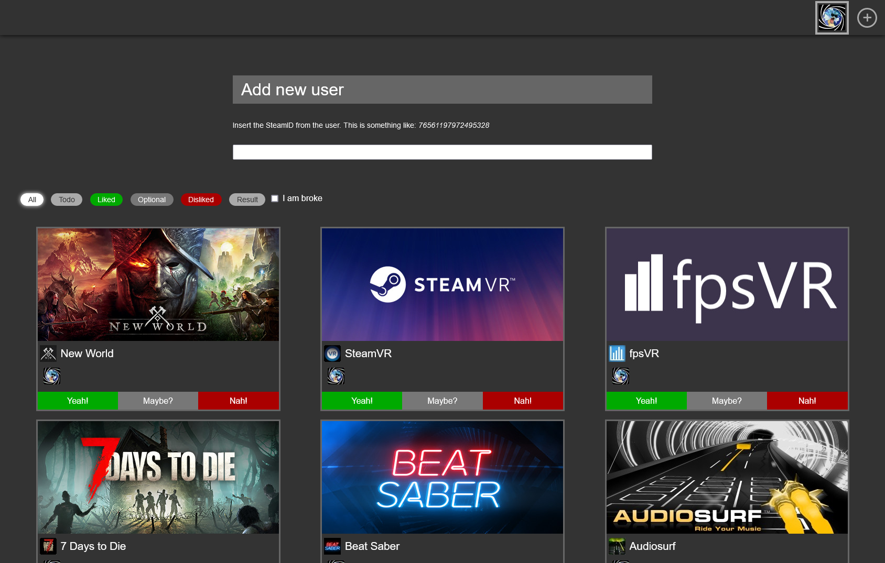

+++
title = "Spieleabend retten"
date = 2022-08-18T15:55:00
weight=180
[taxonomies]
tags=["blog","project","steam","howto"]
authors=["Max Brauer"]
+++

# Spieleabend retten

Wer kennt das nicht? Du sitzt mit deinen Freunden am Abend vorm Rechner, jeder hat eine gut
gefüllte Steam-Bibliothek und keiner hat eine Ahnung, was man nun spielen könnte? Eher ins Bett
gehen kommt nicht in Frage und zum erneuten Mal immer und immer wieder das gleiche Spiel starten
will auch keiner. Hierfür habe ich eine Lösung entwickelt. Nun ja, teilweise.

<!-- more -->

Diese Webseite liest von euch allen die Spiele in eurer Steam-Bibliothek ein (sofern ihr diese
öffentlich zugänglich geschalten habt) und schaut, welche Spiele ihr alle habt und welche ihr
spielen könntet. Dann kann jeder die Liste durchgehen und markieren, worauf er Lust, mäßig Lust
oder überhaupt keine Lust hat. Dabei werden die Eingaben immer in Echtzeit mit den anderen
synchronisiert und zum Schluss kommt eine Liste mit Spielen heraus, worauf ihr alle Lust habt.
Das klappte bisher meistens sehr gut.

## Wie nutze ich das?

Zu aller erst müsst ihr euer Steam Profil vorbereiten. Die Webseite kann nur Spiele finden, wenn
ihr diese auch auf öffentlich gestellt habt. Wie das genau funktioniert, steht
[hier](https://help.steampowered.com/de/faqs/view/588C-C67D-0251-C276).

1. Ihr braucht von jedem die Steam ID oder manchmal auch Steam 64 ID genannt. Das ist eine sehr
    große Zahl. Ihr könnt Tools wie [steamdb.info](https://steamdb.info) nutzen oder ihr kopiert
    die URL eurer Profile und sucht euch das aus der URL heraus. Dieser Schritt ist der
    Schwierigste, aber sobald einmal geschehen, könnt ihr euch das irgendwo sichern, die Zahl
    ändert sich nicht.
2. Einer von euch geht auf [play.2complex.de](https://play.2complex.de/). Die URL aktualisiert
    sich automatisch und ein Code wird angefügt. Dieser schickt den Link den anderen und schon
    sind sie in der gleichen Lobby.
3. Nun tragt ihr nach und nach die Steam IDs ein und bestätigt dies mit Enter.
4. Jeder sucht sich sein Profil raus und schon kann der Spaß beginnen!

Jeder kann bei sich die Spiele mit `Yeah!`, `Maybe?` und `Nah!` abstimmen. Die Spiele werden dann
anhand der Wertungen automatisch neu sortiert, sodass die beliebtesten immer oben stehen.
Außerdem gibt es 6 verschiedene Filter:

- `All`: Zeigt alle Spiele ungefiltert an.
- `Todo`: Zeigt alle Spiele an, bei denen du noch keine Bewertung hinterlegt hast. Hat ein anderer
    bei dem Spiel ein `Nah!` angegeben, dann wird dies automatisch aus dieser Auflistung entfernt.
- `Liked`: Zeigt alle Spiele an, wo du ein `Yeah!` gestimmt hast.
- `Optional`: Zeigt alle Spiele an, wo du ein `Maybe?` gestimmt hast.
- `Disliked`: Zeigt alle Spiele an, wo du ein `Nah!` gestimmt hast.
- `Result`: Zeigt die Ergebnisansicht an. Dies entspricht weitestgehend `All`, nur dass alle Spiele
    rausgefiltert werden, bei den mindestens einer `Nah!` gestimmt hat.

Des Weiteren gibt es für jeden die `I am broke` Option. So kann jeder für sich entscheiden, dass er
keine neuen Spiele kaufen möchte. Dann wird bei allen alle Spiele ausgeblendet, die der Pleitegeier
nicht hat. Derzeit werden kostenlose Spiele nicht berücksichtigt.

## Probleme

- Wenn ihr viele Spiele habt (> 500), dann kann es dauern, bis die Webseite diese geladen hat.
    Wartet bitte einfach kurz ab. Meist kann in wenigen Sekunden der Spaß weitergehen.
- Die Daten werden nicht permanent hinterlegt. Sobald alle die Sitzung verlassen haben, wird der
    Link ungültig und alle Daten werden gelöscht. Klickt einer erneut auf den Link, so wird eine
    neue, leere Sitzung erstellt und ein neuer Link generiert.
- Die Steam-Daten werden für ein paar Stunden gecacht. Wenn also jemand gerade ein neues Spiel
    gekauft hat, dann kann es sein, dass es nicht sofort gelistet wird.

## Features oder Bugs?

Natürlich sind das alles Features!

1. Oben rechts wird die Liste der aktuellen Accounts angezeigt. Ihr könnt dort einfach draufklicken
    und dann seid ihr einfach diese Person und stimmt für die ab. Damit könnt ihr auch gut auf
    einen Blick sehen wer für was abgestimmt hat oder für den die Stimme oder Einstellungen
    ändern. Habt Spaß, seid aber kein Arschloch!

## Technisches

Ich werde demnächst noch einen Post schreiben, wo ich auf ein paar interessante technische Dinge
eingehen werde.

{{ remark_comments() }}
