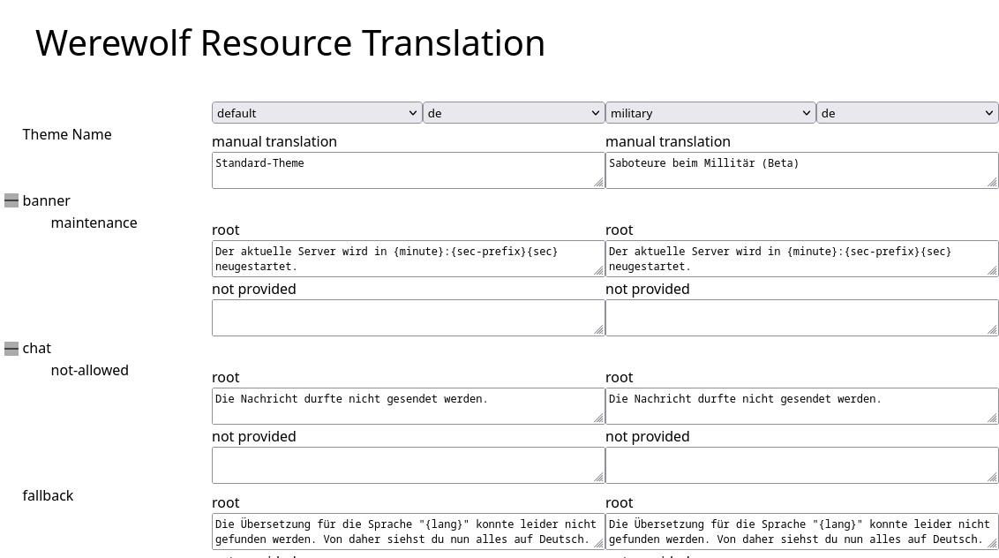

+++
title = "Übersetzungsseite für Werwölfe von Düsterwald"
date = 2022-08-19T18:00:00
weight=190
[taxonomies]
tags=["blog","project","werewolf"]
+++

# Übersetzungsseite für Werwölfe von Düsterwald

Ich habe über die letzten Tage hinweg wieder an meinem Werwolf-Projekt gearbeitet - ein
Dauerprojekt, wo ich nun schon über 5 Jahre dran arbeite und sehr viele Iterationen durchlebt hat.
Ich habe dabei wieder den Aspekt der Mehrsprachigkeit und den Themes befasst und dafür nun einen
[Editor](https://werewolf.2complex.de/content/special/translation.html) erstellt.

<!-- more -->

Werwölfe nutzt hierzu im Hintergrund eine Liste von Sprachdateien, die je nach Sprache oder Theme
ausgetauscht oder kombiniert werden. Der Editor erlaubt es die Dateien übersichtlich zu bearbeiten,
als es vorher mit einen Texteditor möglich gewesen wäre.

## Was sind die Sprachdateien?

Die Sprachdateien sind verschiedene JSON-Dateien, welche verschachtelte Objekte und einzelne Strings
enthalten. Der Pfad zu den einzelnen Strings entspricht somit den Schlüssel des Textes, der von der
Anwendung abgefragt wird.

Im Ordner `/content/lang/` werden dann die einzelnen Sprachdateien in verschiedene Unterordner
einsortiert, welche dann die genaue Verwendung der Dateien angibt.

## Welche Sprachdateien gibt es?

Die Datei `/content/lang/index.json` gibt ein Verzeichnis der Dateien an und welche Sprachen und
Themes unterstützt werden.

Dazu gibt es im Ordner `/content/lang/root/` die Basistexte, welche für alle Themes in einer Sprache
gelten. Diese können aber durch die einzelnen Themes überschrieben werden.

Im Ordner `/content/lang/{system}/{theme}/` gibt es dann die Texte für die einzelnen Themes.
`{system}` ist hierbei eine spezifische Implementierung, welche von Werwolf unterstützt wird.
Derzeit gibt es nur `Werewolf.Theme.Default.DefaultTheme`. `{theme}` ist eine beliebiges Theme,
welches angewandt wird. Standardmäßig gibt wird immer `default` verwendet. Alle Themes verhalten
sich in einem System gleich, nur die Texte sind anders. 

## Wie wird das bearbeitet?

Im Editor werden drei Spalten angezeigt. Die linke Spalte zeigt hierarchisch die Schlüssel zu den
einzelnen Texten an. In der zweiten und dritten Spalte kann jeweils ein Theme und Sprache
eingestellt werden, welche derzeit bearbeitet werden soll. So können leicht Übersetzungen oder
Themes angepasst werden. Die Auswahl des Themes oder der Sprache wird in der Tabellenkopf gemacht.

Die Anzeige unterscheidet dabei folgende Status:

- `not provided`: Der Text wurde nicht hinterlegt. Bei manchen Texten wird die andere Variante aus
  dem Basis oder Theme genutzt. Wenn beide keinen Text enthalten, so wird ein Platzhalter in der
  Oberfläche angezeigt.
- `manual translation`: Dieser Text wurde von einer menschlichen Person hinterlegt. Dies trifft
  derzeit auf alle Texte zu.
- `automatic by ...`: Diese Texte wurden automatisch vom angegebenen System übersetzt. Diese
  Funktion ist derzeit in Arbeit und noch nicht released. Dies trifft derzeit auf keine Texte zu.
  (Die Übersetzungen haben derzeit eine sehr schlechte Qualität.)
- `modified`: Die Texte sind von dir bearbeitet wurden. Über `reset` kannst du das zurücksetzen.

Außerdem wird noch angezeigt, wenn gerade ein Theme bearbeitet wird und es einen Text im der
`root`-Sprachdatei existiert. Dazu wird eine Box über den Editor mit dem Status `root` angezeigt.
Der Inhalt der Box kann nicht verändert werden, dazu ist ein Wechsel in den Modus nötig.

Nachdem alles bearbeitet ist, gibt es unten einen Knopf, wo alle Änderungen heruntergeladen werden
können. Diese Datei kann dann als [neues Issue](https://github.com/Garados007/Werewolf/issues/new)
mir wieder zugeschickt werden.

## Was fehlt noch?

Derzeit fehlen dem Editor noch Funktionen um neue Sprachen oder Themes hinzuzufügen. Dies geht
weiterhin nur klassisch über die JSON-Dateien.

Außerdem hat der Editor kein tieferes Wissen über die Schlüssel, so kann dieser keine neuen
Schlüssel anlegen oder vorschlagen, wo es vom Sprachsystem her vorgesehen ist. Dies wird zum
Beispiel vom Sprachsystem genutzt, um in bestimmten Situationen bestimmte Leute andere Sachen sagen
zu lassen, als standardmäßig vorgesehen ist (Beispiel: Optionen für die Votings).

Weiterhin werden derzeit keine Infotexte für die Schlüssel angezeigt, damit der Nutzer ablesen kann,
wofür der Text genutzt wird.

## Wo kann ich starten?

Webseite: [https://werewolf.2complex.de/content/special/translation.html](https://werewolf.2complex.de/content/special/translation.html)
